# Malaria Mortality Prediction in Brazil

[](https://opensource.org/licenses/MIT)
[](https://www.python.org/downloads/)
[](https://pandas.pydata.org/)
[](https://scikit-learn.org/)
[](https://pytorch.org/)
[](https://shap.readthedocs.io/)

## Overview

This project focuses on predicting malaria-related mortality ("Deaths") in Brazilian counties using a combination of environmental, economic, and geographical data. The dataset is preprocessed from multiple sources, including weather metrics, GDP, building surface area, and drought indices. Two modeling approaches are implemented:

- **Machine Learning (Random Forest Regressor)**: A traditional ML model for regression.
- **Deep Learning (PyTorch MLP)**: A neural network-based model for improved prediction.

Both models use SHAP (SHapley Additive exPlanations) for interpretability, generating feature importance rankings, dependence plots, and other visualizations to explain predictions.

The goal is to identify key factors influencing malaria deaths, such as climate variables (e.g., precipitation, temperature) and socioeconomic indicators (e.g., GDP).

### Key Features
- Data preprocessing and aggregation from yearly, monthly, and weekly sources.
- Predictive modeling for mortality rates.
- Explainable AI (XAI) using SHAP to highlight feature impacts.
- Visualization of results (plots, tables, distributions).

## Dataset

The data is stored in the `Data/` directory and includes Excel files for:
- Building surface area (`Building_surface_area.xlsx`).
- Gross Domestic Product (`GDP.xlsx`).
- Subnational unit data with deaths and clinical cases (`Subnational Unit-data_Edit_1.xlsx`).
- Microregions mapping (`111111.xlsx`).
- Environmental metrics: Precipitation, Temperature (min/max/mean), Wind Speed, Relative Humidity, Atmospheric Pressure, NDVI, Palmer Drought Severity Index.

The preprocessing script (`Preprocess.py`) combines these into `combined_data.csv` (or `.xlsx` for modeling).

**Note**: Data appears to cover Brazilian states and counties (microregions) from various years. Ensure data privacy and ethical use, as it involves health metrics.

## Requirements

- Python 3.8+
- Libraries:
  - `pandas`
  - `numpy`
  - `matplotlib`
  - `seaborn`
  - `scikit-learn`
  - `shap`
  - `torch` (for deep learning)

Install dependencies using:
```bash
pip install -r requirements.txt
```

Sample `requirements.txt`:
```
pandas==2.0.3
numpy==1.24.3
matplotlib==3.7.2
seaborn==0.12.2
scikit-learn==1.3.0
shap==0.42.1
torch==2.0.1
```

## Project Structure

```
├── Data/                        # Raw data files (Excel)
│   ├── Building_surface_area.xlsx
│   ├── Gross_Domestic_Product.xlsx
│   ├── Subnational Unit-data_Edit_1.xlsx
│   ├── Microregions mapping.xlsx  # Microregions mapping
│   ├── Palmer_Drought_Severity_Index.xlsx
│   ├── Sum_precipitation.xlsx
│   ├── Mean_temperature.xlsx
│   ├── Maximum_temperature.xlsx
│   ├── Minimum_temperature.xlsx
│   ├── Mean_wind_speed.xlsx
│   ├── Mean_relative_humidity.xlsx
│   ├── Mean_atmospheric_pressure.xlsx
│   ├── Mean_Normalized_Difference_Vegetation_Index.xlsx
│   └── combined_data_Deaths.xlsx # Processed data for modeling
├── ML/                          # Outputs from ML model (plots, tables)
│   ├── shap_summary_beeswarm.png
│   ├── shap_feature_importance.png
│   ├── shap_feature_importance_detailed.xlsx
│   ├── shap_dependence_plots.png
│   ├── shap_force_plot_sample.png
│   ├── shap_interaction_plot.png
│   ├── shap_worst_prediction.png
│   ├── shap_value_distributions.png
│   └── shap_feature_importance.csv
├── Deep/                        # Outputs from Deep Learning model (plots, tables, model)
│   ├── pytorch_training_loss.png
│   ├── pytorch_prediction_comparison.png
│   ├── shap_pytorch_summary_beeswarm.png
│   ├── shap_pytorch_feature_importance.png
│   ├── shap_pytorch_feature_importance_detailed.xlsx
│   ├── shap_pytorch_feature_importance.csv
│   ├── shap_pytorch_dependence_plots.png
│   ├── shap_pytorch_worst_prediction.png
│   ├── shap_pytorch_best_prediction.png
│   ├── shap_pytorch_value_distributions.png
│   ├── shap_pytorch_top15_features.png
│   ├── shap_pytorch_correlation_matrix.png
│   └── pytorch_model_complete.pth
├── Preprocess.py                # Data preprocessing script
├── X_AI_ML.py                   # Random Forest + SHAP analysis
├── X_AI_Deep.py                 # PyTorch MLP + SHAP analysis
├── requirements.txt             # Dependencies
├── README.md                    # This file
└── LICENSE                      # MIT License
```

## Usage

### 1. Data Preprocessing
Run the preprocessing script to combine data:
```bash
python Preprocess.py
```
- Outputs: `combined_data.csv` (aggregated yearly data).

### 2. Machine Learning Model (Random Forest)
Run:
```bash
python X_AI_ML.py
```
- Trains a Random Forest Regressor on `combined_data_Deaths.xlsx`.
- Computes SHAP values.
- Generates:
  - Plots: Beeswarm, bar, dependence, force, interaction, distributions.
  - Tables: Feature importance (`ML/shap_feature_importance_detailed.xlsx`, `ML/shap_feature_importance.csv`).
  - Metrics: R², MAE, RMSE.

### 3. Deep Learning Model (PyTorch MLP)
Run:
```bash
python X_AI_Deep.py
```
- Trains a Multi-Layer Perceptron (MLP) neural network.
- Computes SHAP values using GradientExplainer.
- Generates similar plots and tables in `Deep/` folder.
- Saves the trained model: `Deep/pytorch_model_complete.pth`.
- Additional visualizations: Learning curve, actual vs. predicted, correlation matrix, top 15 features bar chart.

## Results and Interpretations

### Machine Learning Model Performance (Random Forest)

#### Model Evaluation Metrics

| Metric | Value |
|:-------|------:|
| Training Samples | 10,713 |
| Test Samples | 2,679 |
| Number of Features | 11 |
| R² Score | 0.8145 |
| Mean Absolute Error (MAE) | 3.30 |
| Root Mean Squared Error (RMSE) | 15.08 |

#### Prediction Analysis

| Prediction Type | Actual Value | Predicted Value | Error |
|:----------------|-------------:|----------------:|------:|
| Worst Prediction | 23.38 | 385.13 | 361.76 |
| Best Prediction | 0.02 | 0.02 | 0.00 |

#### Top 11 Feature Importance (Random Forest + SHAP)

| Rank | Feature | Mean \|SHAP\| | Mean SHAP | Std SHAP | Max SHAP | Min SHAP |
|:----:|:----------------|-------------:|-----------:|----------:|----------:|-----------:|
| 1 | Year | 5.12 | -0.36 | 11.45 | 116.82 | -73.98 |
| 2 | Min Temperature | 5.09 | -1.00 | 7.34 | 43.28 | -34.78 |
| 3 | Precipitation | 4.15 | 0.23 | 8.59 | 122.09 | -26.26 |
| 4 | Wind Speed | 3.43 | 0.30 | 6.00 | 63.86 | -15.97 |
| 5 | Relative Humidity | 3.42 | 0.37 | 12.86 | 188.83 | -11.65 |
| 6 | NDVI | 1.20 | 0.06 | 4.14 | 66.05 | -6.63 |
| 7 | Mean Temperature | 1.05 | 0.00 | 1.93 | 12.82 | -19.86 |
| 8 | Max Temperature | 0.72 | 0.50 | 1.26 | 25.04 | -12.00 |
| 9 | Building Area | 0.48 | 0.09 | 1.36 | 23.39 | -11.62 |
| 10 | GDP | 0.47 | -0.06 | 1.41 | 22.74 | -22.24 |
| 11 | Atmospheric Pressure | 0.43 | -0.10 | 0.79 | 5.47 | -8.98 |

---

### Deep Learning Model Performance (PyTorch MLP)

#### Model Evaluation Metrics

| Metric | Value |
|:-------|------:|
| Total Samples | 13,392 |
| Training Samples | 10,713 |
| Test Samples | 2,679 |
| Number of Features | 11 |
| Model Architecture | MLP with 13 layers |
| Training Epochs | 100 |
| R² Score | 0.5573 |
| Mean Absolute Error (MAE) | 6.22 |
| Root Mean Squared Error (RMSE) | 23.31 |

#### Training Progress (Selected Epochs)

| Epoch | Train Loss | Validation Loss |
|------:|-----------:|----------------:|
| 10 | 663.31 | 492.20 |
| 20 | 599.39 | 549.79 |
| 30 | 613.22 | 581.40 |
| 40 | 633.58 | 614.07 |
| 50 | 639.83 | 578.21 |
| 60 | 608.13 | 599.74 |
| 70 | 624.07 | 686.50 |
| 80 | 611.55 | 558.48 |
| 90 | 611.46 | 781.50 |
| 100 | 609.78 | 543.22 |

#### Prediction Analysis

| Prediction Type | Actual Value | Predicted Value | Error |
|:----------------|-------------:|----------------:|------:|
| Worst Prediction | 157.33 | 514.73 | 357.39 |
| Best Prediction | 0.01 | 0.02 | 0.01 |

#### Top 11 Feature Importance (PyTorch + SHAP)

| Rank | Feature | Mean \|SHAP\| | Mean SHAP | Std SHAP | Max SHAP | Min SHAP |
|:----:|:----------------|-------------:|-----------:|----------:|----------:|-----------:|
| 1 | Min Temperature | 4.73 | 0.41 | 11.40 | 111.51 | -13.71 |
| 2 | Year | 3.59 | -0.07 | 10.98 | 140.48 | -29.91 |
| 3 | Mean Temperature | 2.52 | 0.26 | 5.17 | 44.78 | -6.20 |
| 4 | Relative Humidity | 2.10 | 0.43 | 6.33 | 62.30 | -9.72 |
| 5 | Wind Speed | 1.99 | 0.30 | 4.65 | 39.47 | -12.12 |
| 6 | Max Temperature | 1.67 | -0.13 | 2.89 | 4.18 | -28.62 |
| 7 | Precipitation | 1.37 | -0.14 | 3.08 | 30.66 | -7.69 |
| 8 | NDVI | 1.00 | -0.09 | 3.98 | 61.14 | -9.35 |
| 9 | Atmospheric Pressure | 0.94 | 0.27 | 3.00 | 40.25 | -3.38 |
| 10 | GDP | 0.75 | 0.19 | 2.82 | 37.91 | -11.94 |
| 11 | Building Area | 0.53 | 0.07 | 1.50 | 7.80 | -22.83 |

---

### Key Insights

**Feature Importance**: Environmental factors like precipitation and temperature dominate predictions, indicating climate's role in malaria spread. Year is also highly influential, potentially capturing temporal trends in malaria control efforts and climate change.

**Model Comparison**: The Random Forest model achieved better performance (R² = 0.81) compared to the PyTorch MLP (R² = 0.56), suggesting that traditional ML methods may be more suitable for this dataset, or that the neural network requires additional tuning.

**SHAP Analysis**: The comprehensive SHAP visualizations reveal non-linear relationships between features and predictions, with temperature variables showing the strongest impacts across both models.

### Example Visualizations (from Random Forest Model)

- **SHAP Force Plot for Sample**:
  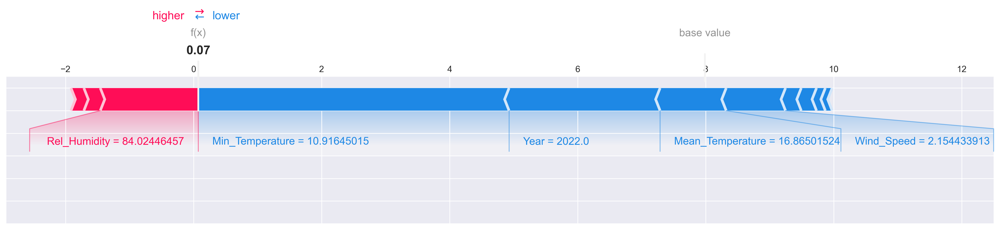

- **Absolute Feature Importance**:
  

- **SHAP Analysis for Worst Prediction**:
  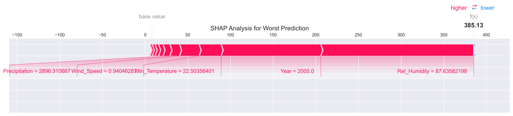

- **Interaction Plot**:
  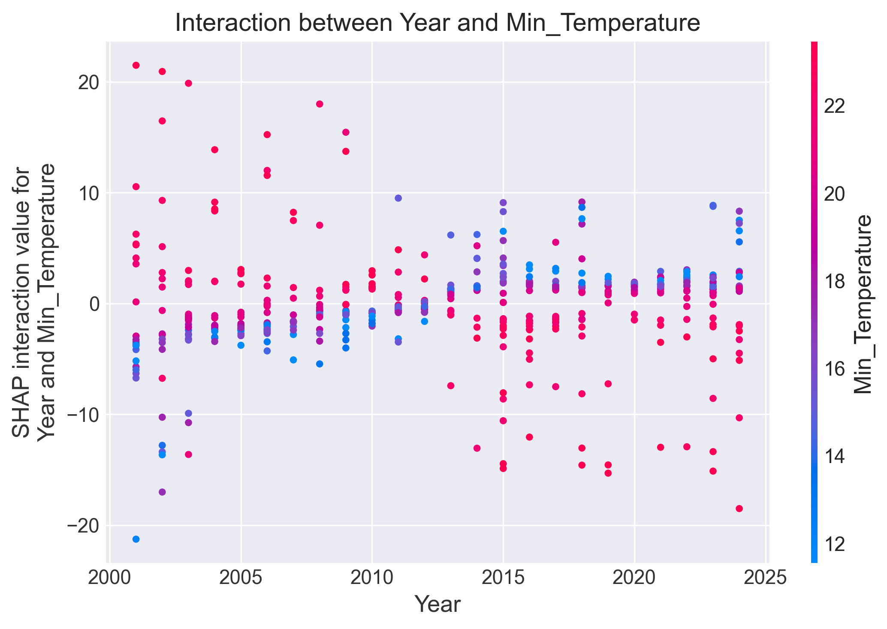

- **Distribution of Feature Impacts (Beeswarm)**:
  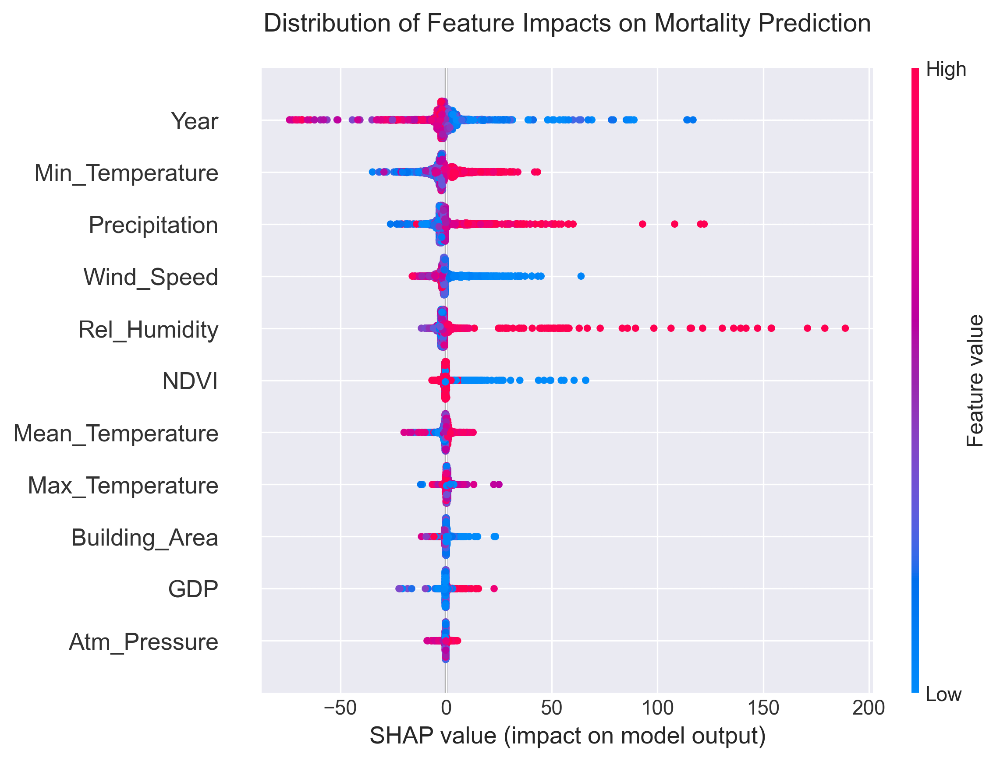

- **SHAP Value Distributions**:
  

- **Dependence Plots**:
  

### Example Visualizations (from PyTorch Model)

- **Top 15 Important Features**:
  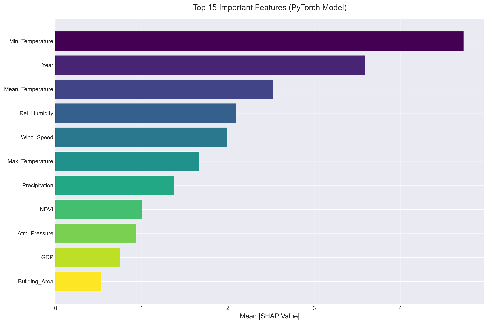

- **Absolute Feature Importance**:
  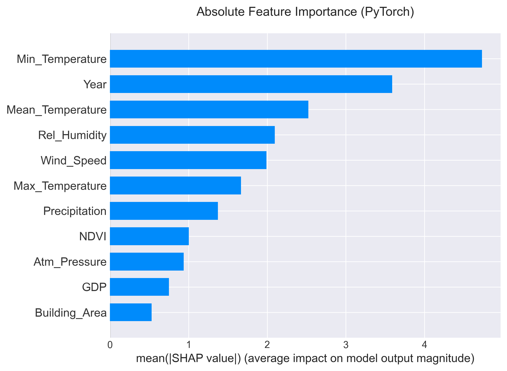

- **SHAP Analysis for Best Prediction**:
  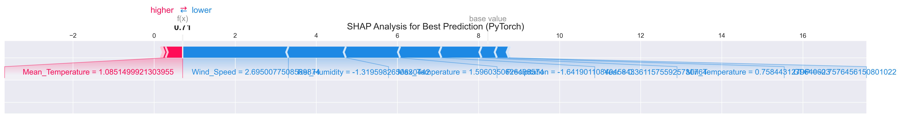

- **Correlation of SHAP Values**:
  

- **SHAP Analysis for Worst Prediction**:
  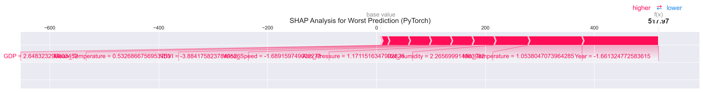

- **SHAP Value Distributions**:
  

- **Model Learning Curve**:
  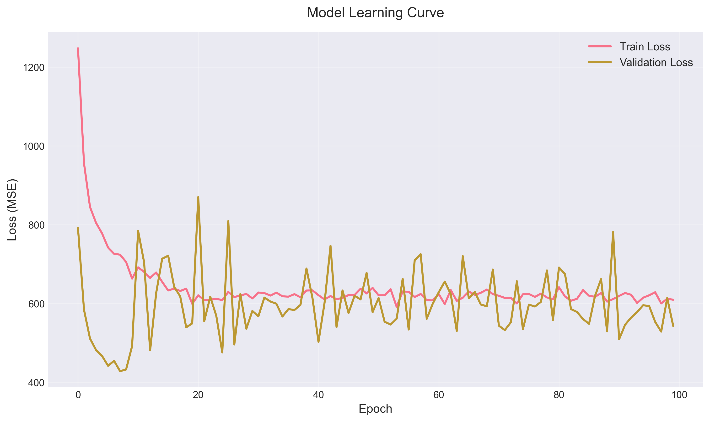

- **Distribution of Feature Impacts (Beeswarm)**:
  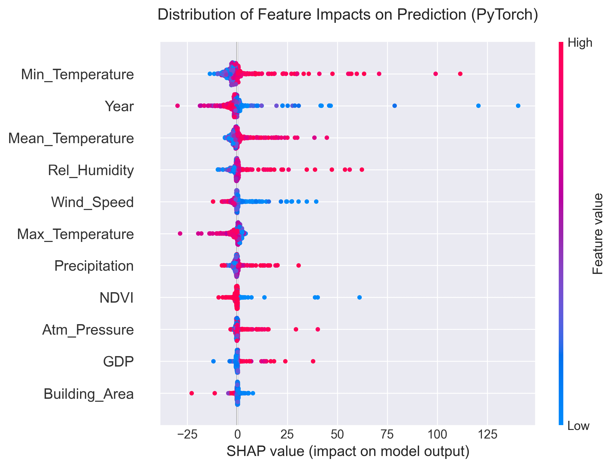

- **Comparison of Actual and Predicted Values**:
  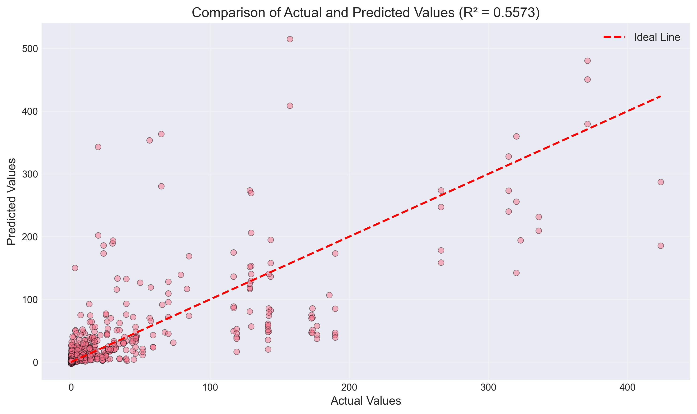

- **Dependence Plots**:
  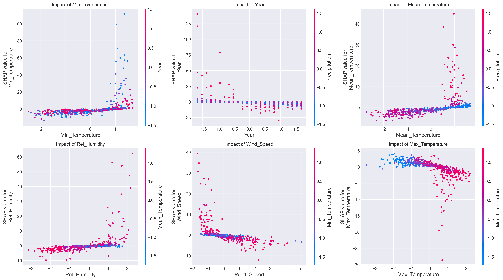

For detailed results, refer to the generated files in `ML/` and `Deep/`.

## Contributing

1. Fork the repository.
2. Create a feature branch (`git checkout -b feature/AmazingFeature`).
3. Commit changes (`git commit -m 'Add some AmazingFeature'`).
4. Push to the branch (`git push origin feature/AmazingFeature`).
5. Open a Pull Request.

## License

This project is licensed under the MIT License - see the [LICENSE](LICENSE) file for details.

## Acknowledgments

- Inspired by public health and environmental data analysis.
- Thanks to libraries like SHAP for XAI capabilities.
- Data sources: Assumed from public Brazilian datasets (e.g., IBGE for microregions, weather APIs).
